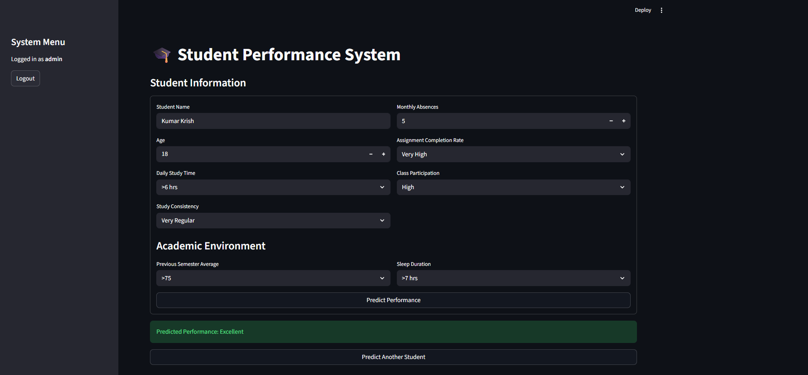
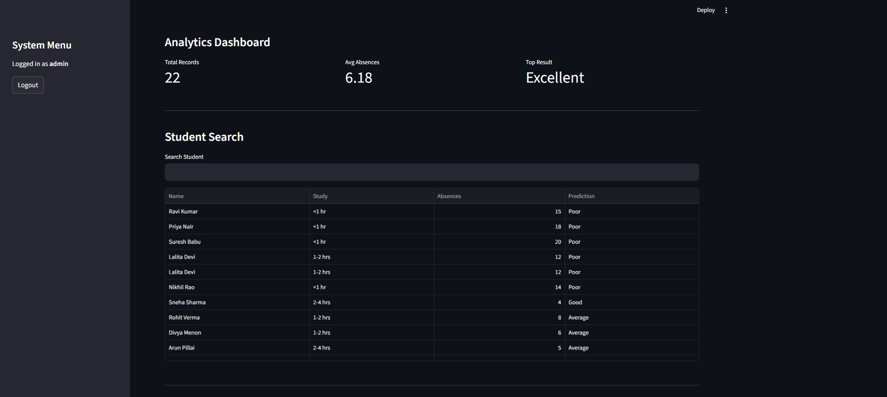
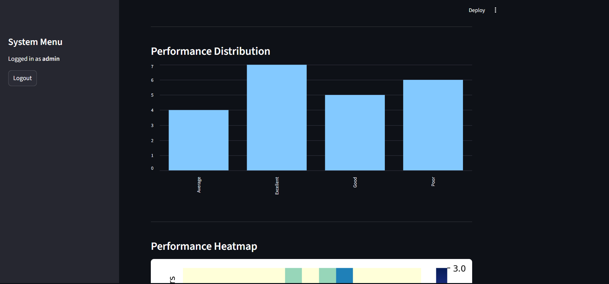
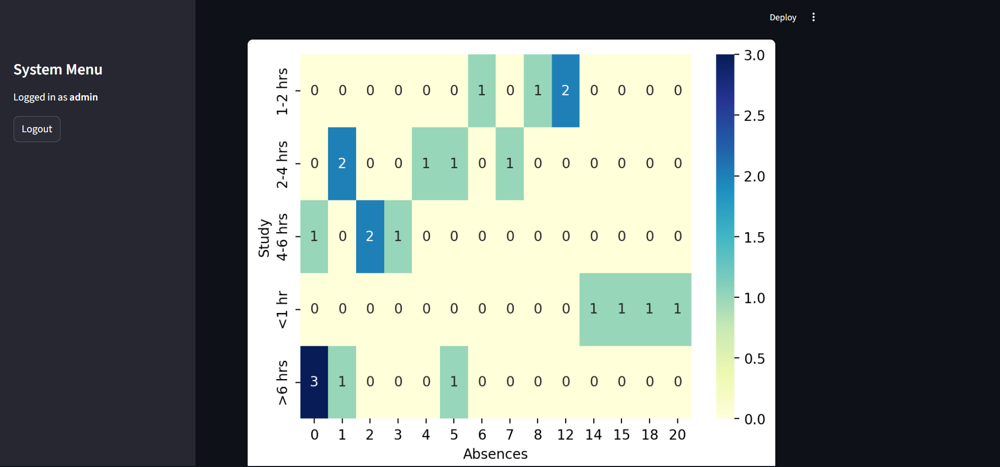
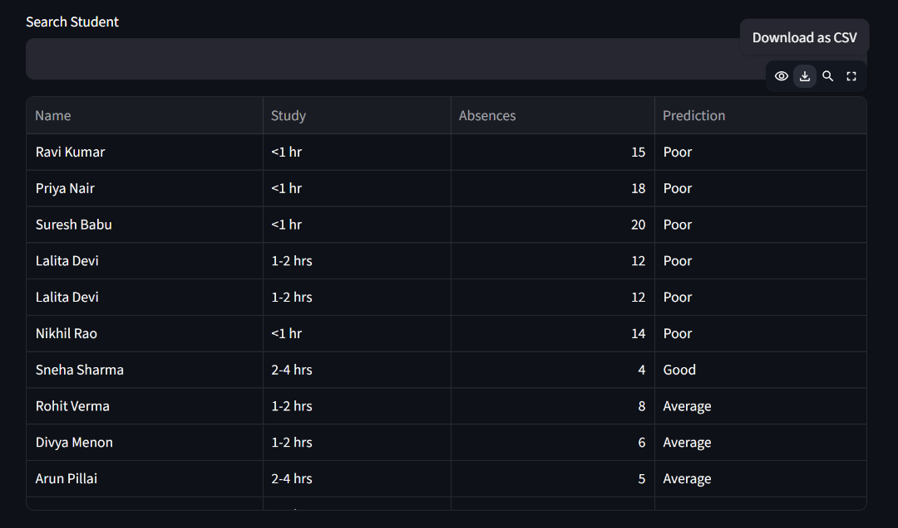
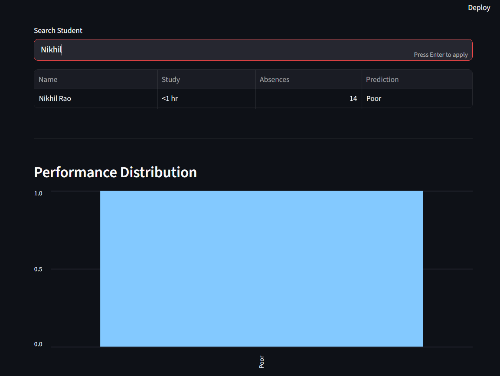

# 🎓 Student Performance Prediction System

> An ML-powered web application that predicts student academic performance based on behavioral, academic, and engagement parameters — with an admin analytics dashboard, student search, and CSV export.

[](https://student-academic-performance-predict.streamlit.app/)
[](https://github.com/sponsors/rajit2004)


---

## 🔗 Live Demo

**[student-academic-performance-predict.streamlit.app](https://student-academic-performance-predict.streamlit.app/)**

> Login: `admin` / `admin123` (admin) or `staff` / `staff123` (staff)

---

## 📸 Screenshots

<table>
  <tr>
    <td><strong>Prediction Form</strong><br/></td>
    <td><strong>Analytics Dashboard</strong><br/></td>
  </tr>
  <tr>
    <td><strong>Performance Distribution</strong><br/></td>
    <td><strong>Performance Heatmap</strong><br/></td>
  </tr>
  <tr>
    <td><strong>Student Records Table</strong><br/></td>
    <td><strong>Student Search</strong><br/></td>
  </tr>
</table>

---

## ✨ Features

- 🔐 **Role-based login** — Admin and Staff access levels
- 🧾 **Student data entry** — study habits, assignments, participation, grades, sleep
- 🤖 **ML prediction** — classifies performance as Poor / Average / Good / Excellent
- 📊 **Analytics dashboard** (Admin only):
  - Total records, average absences, top result
  - Performance distribution bar chart
  - Study time vs absences heatmap
  - Student search functionality
  - CSV export
- 🔄 **Multi-student support** — form resets after each prediction
- 🧪 **Automated UI testing** — Playwright script to run 20 test cases automatically

---

## 🧠 ML Model

| Detail | Info |
|---|---|
| Algorithm | Random Forest Classifier |
| Type | Multi-class Classification |
| Output Classes | Poor, Average, Good, Excellent |
| Test Accuracy | 18/20 (90%) on automated test suite |

**Input features:**
- Daily Study Time
- Study Consistency
- Assignment Completion Rate
- Class Participation
- Previous Semester Average
- Sleep Duration
- Age

---

## 🛠️ Tech Stack

| Layer | Technology |
|---|---|
| UI | Streamlit |
| ML Model | Scikit-learn (Random Forest) |
| Data Processing | Pandas, NumPy |
| Visualization | Matplotlib, Seaborn |
| UI Testing | Playwright |

---

## ⚡ Setup & Usage

### 1. Clone the repo
```bash
git clone https://github.com/rajit2004/student-performance-prediction.git
cd student-performance-prediction
```

### 2. Install dependencies
```bash
pip install -r requirements.txt
```

### 3. Run the app
```bash
streamlit run app.py
```

### 4. Login
| Role | Username | Password |
|---|---|---|
| Admin | admin | admin123 |
| Staff | staff | staff123 |

---

## 🧪 Automated UI Testing

This project includes a Playwright-based test script that automatically runs 20 student profiles through the app and validates predictions.

### Setup
```bash
pip install playwright
playwright install chromium
```

### Run tests
```bash
# Make sure the app is running first
streamlit run app.py

# Then in a separate terminal
python autofeed.py
```

### Test results (latest run)
```
Passed: 18/20
❌ Sneha Sharma: Expected Average, Got Good     ← model edge case
❌ Pooja Krishnan: Expected Good, Got Excellent ← model edge case
```

The 2 failures are known edge cases where the model predicts higher than expected for borderline profiles — not bugs.

---

## 📁 Project Structure

```
student-performance-prediction/
├── app.py              # Main Streamlit application
├── autofeed.py         # Playwright automated UI test 
script
├── requirements.txt    # Dependencies
├── screenshots/        # App screenshots
└── README.md
```

---

## 🎯 Future Improvements

- Integration with real academic datasets
- Advanced ML models (XGBoost, Neural Networks)
- Feature importance visualization
- Student risk detection system
- Database integration (PostgreSQL / MongoDB)
- Automated daily test runs via GitHub Actions

---

## 💖 Support

If this project helped you, consider supporting my work:

[](https://github.com/sponsors/rajit2004)

---

## 👨‍💻 Author

**Ranesh Rajit** — B.Tech CS Student, India

[](https://github.com/rajit2004)